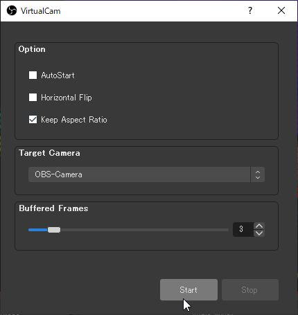

# Azure Kinect Image Effects
 
 ## Usage
 1) Run <b>KinectCapture4PC.exe</b>.  
 2) Select a mode as you like. (Please see follwoing video) 
 
 

## Example of using this app with remote communication tool
### Setup
1) Create Zoom account.  
https://zoom.us/   
2) OBS Studio   
https://obsproject.com/    
3) OBS Virtual Cam  
https://github.com/CatxFish/obs-virtual-cam/releases   

### Usage
1) Run <b>KinectCapture4PC.exe</b>.  
2) Select a mode as you like.  
3) Launch OBS Studio.  
4) Click <b>Settings</b>. 
  
5) Select <b>Video</b>. 
6) Set <b>Base(Canvas) Resolution</b> and <b>Ooutput(Scaled) Resolution</b> as <b><u>320x288</u></b>. 
7) Click <b>Apply</b> 
  
8) Click Add (+) button in the Souces area. 
9) Clic <b>Window Capture</b>. 
  
10) Click <b>OK</b> button of Create/Slect Sources window. 
11) Select <b>[KiectCapture4PC.exe]: Viewer</b> from dropdown menue of Window. 
12) Click OK 
  
13) Click <b>Tools</b>.  
14) Click <b>VirtualCam</b>. 
  
15) Turn on <b>Keep Aspect Ratio</b>.  
16) Select <b>OBS-Camera</b> from Target Camera  
17) Cick <b>Start</b> button. 
  
18) Launch Zoom application  
19) Open settings  
20) Select Video from the setting menue shown in the left.  
21) Select OBS-Camera from Camera list.  
  
21) Please re-select <b>Keep Aspect Ratio</b> in the Virtual Cam of OBS if aspect ratio is not correct. 
 

# Give Me Your Feedback
I'm glad if you'll give me feedback, or tag me when you share the video of your experience on SNS or other web-media.  
<b>Contact Me</b> 
Twitter: @Tks_Yoshinaga (https://twitter.com/Tks_Yoshinaga) 
LinkedIn: Takashi Yoshinaga (https://www.linkedin.com/in/tks-yoshinaga/?locale=en_US) 
Instagram: tks_yoshinaga　(https://www.instagram.com/tks_yoshinaga/) 
  

