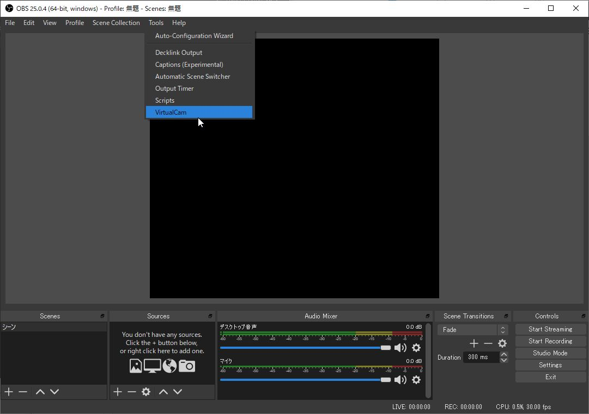

# Azure Kinect Image Effects
 
 ## Usage
 1) Run <b>KinectCapture4PC.exe</b>.  
 2) Select a mode as you like. (Please see follwoing video)
 

## Use case with remote communication tool
### Setup
1) Create Zoom account.  
https://zoom.us/   
2) OBS Studio   
https://obsproject.com/    
3) OBS Virtual Cam  
https://github.com/CatxFish/obs-virtual-cam/releases   

### Usage
1) Run <b>KinectCapture4PC.exe</b>.  
2) Select a mode as you like.  
3) Launch OBS Studio.  
4) Click <b>Settings</b>. 
  
5) Select <b>Video</b>. 
6) Set <b>Base(Canvas) Resolution</b> and <b>Ooutput(Scaled) Resolution</b> as <b><u>320x288</u></b>. 
7) Click <b>Apply</b> 
  
8) Click Add (+) button in the Souces area. 
9) Clic <b>Window Capture</b>. 
  
10) Click <b>OK</b> button of Create/Slect Sources window. 
11) Select <b>[KiectCapture4PC.exe]: Viewer</b> from dropdown menue of Window. 
9)   
8) Click <b>Tools</b>.  
9) Click <b>VirtualCam</b>. 
  
